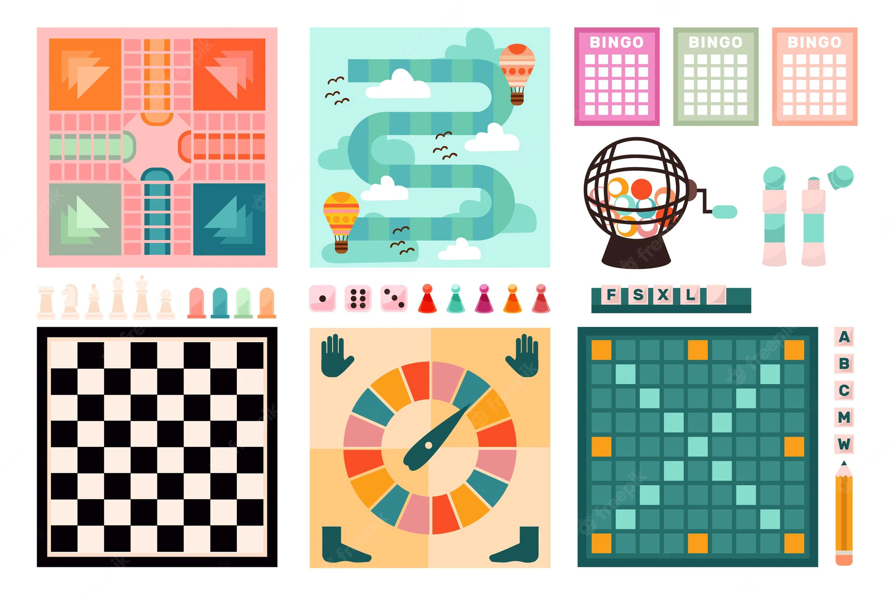

# Diceboard

¡Impresionante trabajo, equipo Nakuru! Ya habéis descubierto una parte muy importante: vuestra app se llamará *Diceboard*, y será una app en la cual los usuarios puedan gestionar sus juegos de mesa.



Cada uno de los `boardgames` tendrá la siguiente estructura:

```js
{
  title: String, 
  players: Number, 
  releaseYear: Number, 
  avgTime: Number, // tiempo medio de partida en minutos
  minAge: Number, // edad mínima para jugar
  image: String,
  description: String,
  owner: ObjectId de User, //¿quién está loguinado en el momento de añadir el juego de mesa?
}
```

Con esta información, debéis:
- Crear el modelo Boardgame
- Crear un archivo con un array de 10 juegos de mesa
- Hacer un seed de la base de datos

Como habéis visto, en el modelo hay una relación. Sin embargo, en el archivo del seed no tenemos acceso a los objetos *request*, *response* y *next* para acceder a req.session.currentUser, así que, en el apartado "owner", podéis copiar y pegar `_id` de usuarios que hayáis creado previamente mediante el `signup`. 

Los `_id` los podéis copiar y pegar de la base de datos mediante Mongo Compass. Así, en el array, cada juego de mesa tendrá un campo así:

```js
{
  ...,
  owner: '63c6f21b0629c422f95e0a7f'
}
```

Estos juegos de mesa iniciales pueden tener todos el mismo owner o podéis coger _ids de diferentes usuarios, pero todos tienen que ser usuarios reales que existan en la base de datos.

> 📍 Cuando acabéis, debéis presentar vuestros avances en el punto de control para recibir las siguientes pistas.


